# TRINETRA — Quantum Exposure Intelligence Platform


> **"Find every cryptographic weakness before a quantum computer does."**

<div align="center">
  <h3><strong>📺 <a href="https://drive.google.com/file/d/1LPlKyv6cbAyb0BZyAdMONuz3OCm26A8c/view?usp=sharing">Watch the Pitch / Demo Video</a></strong></h3>

</div>


TRINETRA is an enterprise-grade post-quantum cryptography (PQC) readiness scanner built for financial institutions. It discovers every public-facing asset of a target domain, performs deep cryptographic analysis across TLS, certificates, APIs, VPNs, SSH, and email, and produces a machine-verifiable **Cryptographic Bill of Materials (CBOM)** with NIST-aligned migration plans and signed PQC readiness certificates.

Built for the **PNB Hackathon** by **Team ZeroHour**.

---

## Table of Contents

- [Why TRINETRA](#why-trinetra)
- [Architecture](#architecture)
- [Unique Selling Points (USPs)](#unique-selling-points)
- [System Components](#system-components)
- [JARSH — AI Assistant](#JARSH--ai-security-assistant)
- [Scan Pipeline](#scan-pipeline)
- [Scoring Formula](#scoring-formula)
- [Classification Schema](#classification-schema)
- [API Reference](#api-reference)
- [Quick Start](#quick-start)
- [Running Without Docker](#running-without-docker)
- [Environment Variables](#environment-variables)
- [Troubleshooting](#troubleshooting)
- [Research Basis](#research-basis)

---

## Why TRINETRA

Cryptographically-Relevant Quantum Computers (CRQCs) are projected to arrive between 2028–2037. When they do, **every RSA, ECDSA, and ECDHE-protected system becomes retroactively decryptable** — including data intercepted today (Harvest Now, Decrypt Later attacks).

Most banks have no idea:
- How many subdomains they actually have (shadow assets)
- Which ones use quantum-vulnerable cryptography
- How much time they have before their data becomes exposed
- What exactly needs to change and in what order

TRINETRA answers all four questions in a single scan.

### The Competition Gap

| Capability | Typical Tools | TRINETRA |
|---|---|---|
| Asset discovery | Known ports only | CT log mining — finds forgotten subdomains |
| TLS analysis | Preferred cipher only | All accepted ciphers — catches weak fallbacks |
| API crypto detection | Header rules | DistilBERT NLP — finds RS256 in JSON bodies |
| Scoring formula | Arbitrary numbers | QARS formula (MDPI 2025) with Mosca's theorem |
| Output | Score only | CBOM + migration plan + signed certificate |
| VPN detection | None | Cisco AnyConnect, Fortinet, Palo Alto, OpenVPN |
| SSH analysis | None | NIST SP 1800-38B compliant host key + KEX audit |

---


## 🛠 Tech Stack

**Frontend:** React 18, Vite, Typescript, TailwindCSS, Recharts  
**Backend:** FastAPI (Async), Python 3.10+, SQLAlchemy, Alembic  
**Scanning Engine:** SSLyze, pyca/cryptography, httpx (Async), Paramiko, Custom DNS/CT pipeline  
**AI & Intelligence:** Custom DistilBERT model (NLP), Local Ollama Mistral 7B (On-prem JARSH logic--finetunned)  
**Task Queues & async pipeline:** Celery, Redis 7, Asyncio  
**Database:** PostgreSQL 16 (Async pipeline)  
**Deployment:** Docker, Docker Compose

---

## Architecture


```
┌─────────────────────────────────────────────────────────────────────────────┐
│                              L1 — INPUT                                     │
│        Domain / IP / URL  ──────  REST API / Batch CSV / Manual Rules       │
│                                           │ (Scheduled Scans)               │
└─────────────────────────┬───────────────────────────────────────────────────┘
                          │
┌─────────────────────────▼───────────────────────────────────────────────────┐
│                           L2 — DISCOVERY                                    │
│                                                                             │
│  ┌──────────────────┐  ┌──────────────────┐  ┌──────────────────────────┐   │
│  │  CT Log Miner    │  │  DNS Resolver    │  │  Port Scanner            │   │
│  │  crt.sh · RFC    │  │  dnspython       │  │  socket · 443/8443/22    │   │
│  │  6962 · 4 source │  │  A/CNAME/MX      │  │  /25/587/1194            │   │
│  │  fallback chain  │  │  liveness check  │  │                          │   │
│  └──────────────────┘  └──────────────────┘  └──────────────────────────┘   │
│                                                                             │
│  ┌──────────────────────────────────────────────────────────────────────┐   │
│  │  Asset Classifier — web_portal | api_endpoint | vpn_gateway |        │   │
│  │                     ssh_endpoint | smtp_mta | staging | shadow_asset │   │
│  └──────────────────────────────────────────────────────────────────────┘   │
│                                                                             │
│      Asyncio Event Loop (Parallel) — Asynchronous & batched processing      │
└─────────────────────────┬───────────────────────────────────────────────────┘
                          │
┌─────────────────────────▼───────────────────────────────────────────────────┐
│                         L3 — DEEP SCAN (Async Pipeline per asset)           │
│                                                                             │
│  ┌────────────────┐  ┌────────────────┐  ┌────────────────┐                 │
│  │  TLS/SSL Scan  │  │  Cert Analyzer │  │  VPN Detector  │                 │
│  │  SSLyze        │  │  pyca/crypto   │  │  banner + path │                 │
│  │  All versions  │  │  Full chain    │  │  fingerprint   │                 │
│  │  All ciphers   │  │  OCSP/SCT/SAN  │  │  Cisco/Forti/  │                 │
│  │  ROBOT/BEAST   │  │  Expiry/issuer │  │  PaloAlto/OVPN │                 │
│  └────────────────┘  └────────────────┘  └────────────────┘                 │
│                                                                             │
│  ┌────────────────┐  ┌────────────────┐  ┌────────────────────────────────┐ │
│  │  API Inspector │  │  SSH Probe     │  │  AI Crypto Classifier          │ │
│  │  httpx async   │  │  paramiko      │  │  DistilBERT fine-tuned         │ │
│  │  JWT/OAuth/    │  │  Host key algo │  │  Catches RS256 in JSON bodies  │ │
│  │  NTLM/CORS/    │  │  KEX methods   │  │  NTLM in WWW-Authenticate      │ │
│  │  GraphQL       │  │  Server banner │  │  Custom auth headers           │ │
│  └────────────────┘  └────────────────┘  └────────────────────────────────┘ │
│                                                                             │
│              Per-asset raw result aggregator — PostgreSQL scan store        │
└─────────────────────────┬───────────────────────────────────────────────────┘
                          │
┌─────────────────────────▼───────────────────────────────────────────────────┐
│                          L4 — ANALYSIS                                      │
│                                                                             │
│  ┌──────────────────────┐  ┌──────────────────────┐  ┌──────────────────┐   │
│  │  CBOM Generator      │  │  HNDL Engine         │  │  Exposure Scorer │   │
│  │  CycloneDX 1.6 JSON  │  │  Mosca's theorem     │  │  QARS formula    │   │
│  │  IBM CBOM spec       │  │  Deadline per asset  │  │  0–100 per asset │   │
│  │  OWASP compatible    │  │  CRQC timeline       │  │  CARAF framework │   │
│  └──────────────────────┘  └──────────────────────┘  └──────────────────┘   │
│                                                                             │
│  ┌──────────────────────────────────┐  ┌──────────────────────────────────┐ │
│  │  PQC Migration Planner           │  │  Certificate Issuer              │ │
│  │  NIST SP 1800-38B step map       │  │  HMAC-signed JSON                │ │
│  │  FIPS 203/204/205 references     │  │  3 tiers: Vulnerable/Ready/Safe  │ │
│  │  Vendor-specific guidance        │  │  Tamper-evident · RBI-ready      │ │
│  └──────────────────────────────────┘  └──────────────────────────────────┘ │
└─────────────────────────┬───────────────────────────────────────────────────┘
                          │
┌─────────────────────────▼───────────────────────────────────────────────────┐
│                           L5 — OUTPUT                                       │
│                                                                             │
│  ┌──────────────────┐  ┌──────────────────┐  ┌──────────────────────────┐   │
│  │  Risk Dashboard  │  │  CBOM Export     │  │  PQC Certificates        │   │
│  │  React 18        │  │  JSON · XML · PDF│  │  Per-asset signed JSON   │   │
│  │  Recharts        │  │  GRC-compatible  │  │  Regulator-presentable   │   │
│  │  Color-coded map │  │  CycloneDX 1.6   │  │  TRN-YYYY-XXXX IDs       │   │
│  └──────────────────┘  └──────────────────┘  └──────────────────────────┘   │
│                                                                             │
│     FastAPI REST — /scan · /cbom · /certificates · /dashboard · /assets     │
│     Docker Compose — PostgreSQL 16 · Redis 7 · Celery workers · Flower      │
└─────────────────────────────────────────────────────────────────────────────┘
```


### Architectural Enhancements
The TRINETRA engine has been completely overhauled from sequential Celery-based processing into a highly concurrent asynchronous architecture:
- **Asyncio Parallelization:** Replaced sequential operations with a concurrent `asyncio` model, processing multiple domains and assets simultaneously.
- **Adaptive Timeouts & Incremental Scanning:** Reduced redundant operations by intelligently skipping unchanged assets and gracefully timing out unresponsive subdomains.
- **Batched ML Inference & Persistence:** Batched DistilBERT inference and database persistence to drastically drop the scan time (e.g., from 17 minutes to ~1.3 minutes for 1,000 assets).
- **Manual Rules Engine:** Users can now set manual heuristic rules directly from the inventory.

---


## Feature Showcase

**1. Home Page**
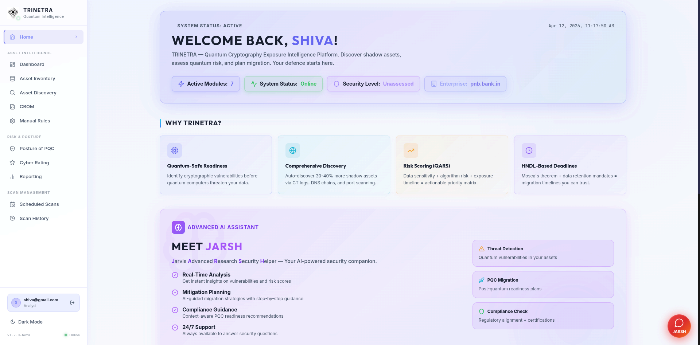
*TRINETRA landing experience showcasing the overall mission.*

**2. Risk Dashboard**
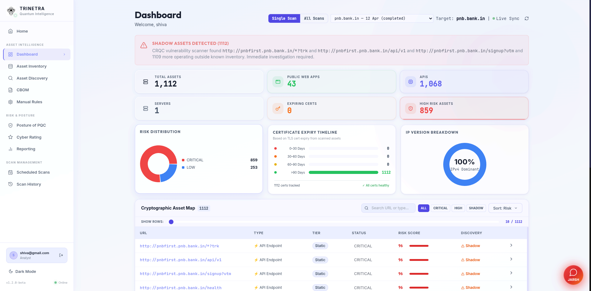
*The central command center providing an organizational risk score, asset map, and risk distribution charts.*

**3. Public Asset Discovery**
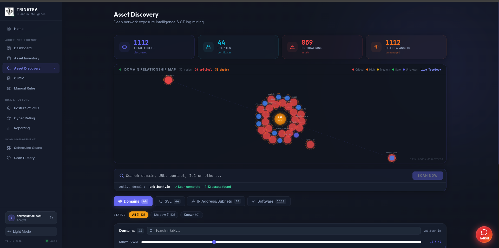
*Visualizing the organization's Live Topology Graph and identifying shadow assets across the domain.*

**4. Asset Inventory & Classifications**
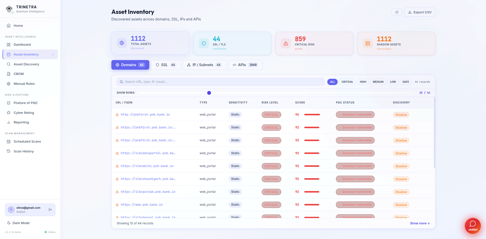
*Detailed inventory of all public-facing assets, categorized by type and sensitivity tier with manual rule overrides.*

**5. Cryptographic Bill of Materials (CBOM)**
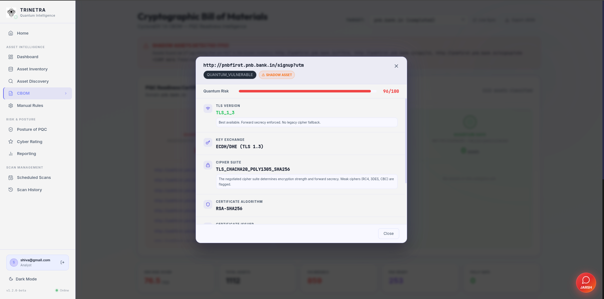
*Operations center displaying cryptographic assets and NIST-aligned migration plans.*

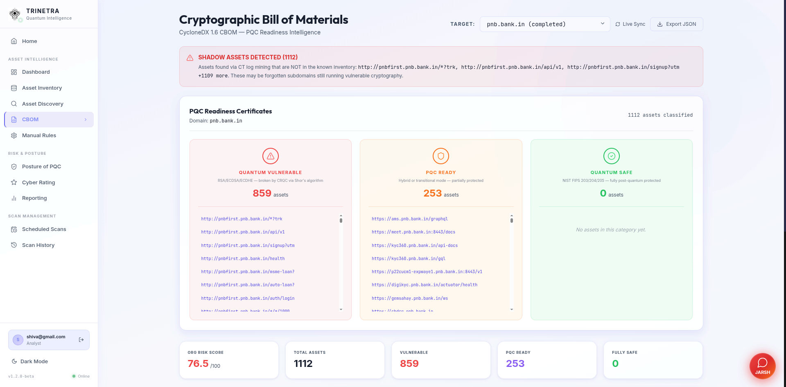
*Deep dive into extracted cryptographic features, including HTTP server software, SSH host keys, and deep SSL analysis.*

**6. Schedule & Automate Scans**
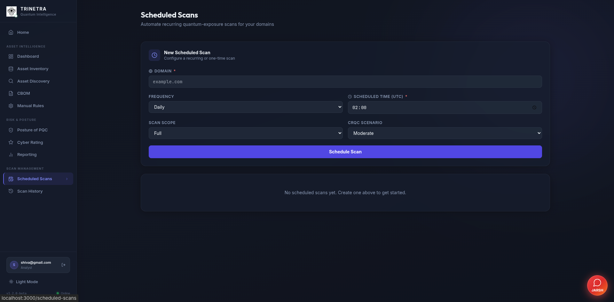
*Configure incremental scanning schedules and manual rules to continuously monitor new and existing assets.*

**7. Posture of PQC**
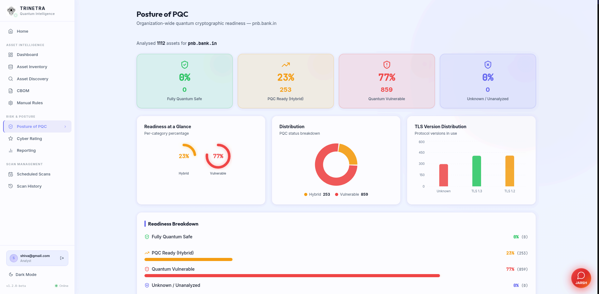
*Migration readiness timeline tracking the step-by-step transition to post-quantum cryptography.*

**8. Cyber Rating & QARS**
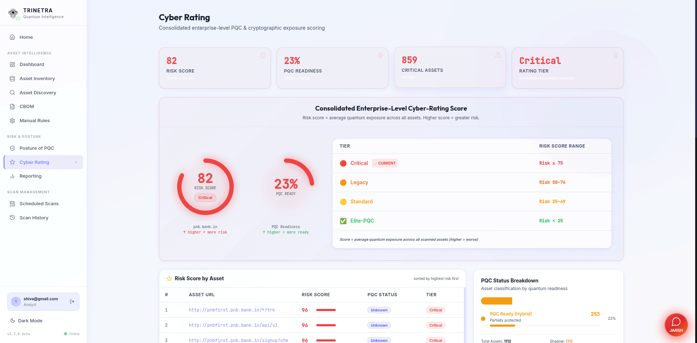
*Visual breakdown of the Quantum-Adjusted Risk Score (QARS) for each asset.*

**9. Scan History**
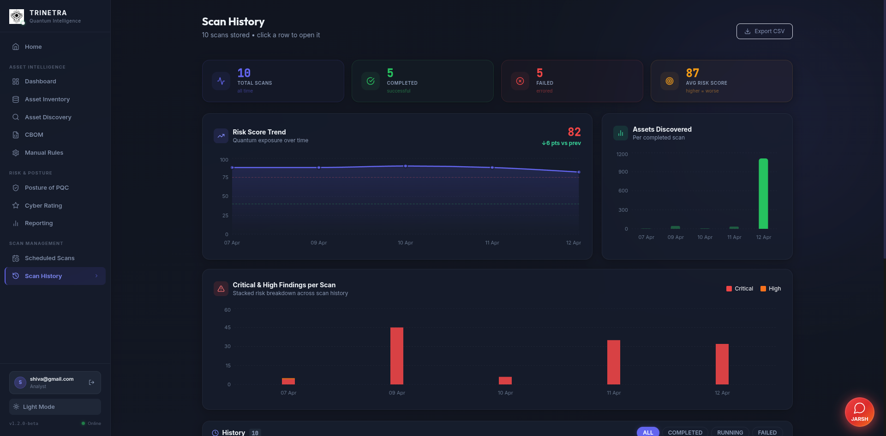
*Tracking historical scan results to monitor cryptographic agility improvements over time.*

**10. Integrated Reporting**
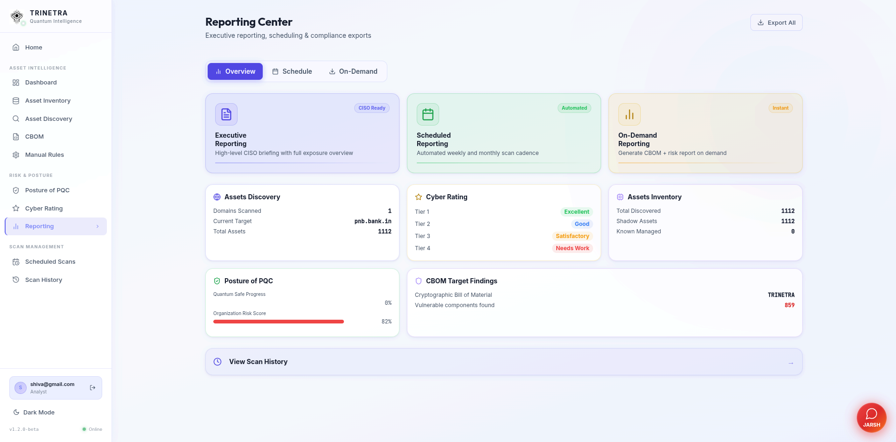
*Generate GRC-compatible PDF reports and CycloneDX 1.6 CBOM exports.*

## Unique Selling Points

### USP 1 — How Our System Finds Assets & Public Asset Discovery
Most scanners only check known ports on known IPs. TRINETRA uses a multi-layered discovery pipeline to map the complete public-facing asset landscape:

1. **CT Log Mining (Shadow Asset Discovery):** Queries **Certificate Transparency logs** (crt.sh, Certspotter, HackerTarget) to find every subdomain a bank has ever registered — including deprecated ones.
2. **Active Crawler & API Inspector:** Moves beyond random scanning by employing a structured crawler that discovers and concurrently scans relevant paths (e.g., `robots.txt`, `sitemap.xml`, API routes).
3. **Live Topology Graphing:** Maps out the relationship and exposure level of discovered assets to create a visual topology (as seen in the Asset Discovery tab).

*Scheitle et al., ACM IMC 2018: CT log data reveals 30–40% more subdomains than DNS enumeration alone.*

### USP 2 — AI Crypto Pattern Classifier
The deterministic TLS scanner checks what it knows about. The **DistilBERT NLP classifier** reads raw HTTP responses the way a human security analyst would — finding cryptographic references buried in:
- `"alg": "RS256"` inside JSON response bodies
- `sha256WithRSAEncryption` inside error messages
- `WWW-Authenticate: NTLM` in response headers
- `"x-signing-algorithm": "rsa-sha256"` in custom proprietary headers
- RSA public key material accidentally exposed in debug endpoints

> *Sanh et al. 2019 (DistilBERT): 40% smaller than BERT with 97% accuracy.*

### USP 3 — HNDL Engine with Mosca's Theorem
Every asset gets a concrete migration deadline, not just a score. The **HNDL (Harvest Now, Decrypt Later) Engine** implements Mosca's inequality:

```
If (data shelf life X) + (migration time Y) > (years to CRQC Z) → Act NOW
```

Configurable CRQC scenarios: pessimistic (2028), moderate (2032), optimistic (2037).

### USP 4 — QARS Scoring Formula
```
Score = (Algorithm Risk × 40%) + (HNDL Timeline × 40%) + (Public Exposure × 20%)
```

Every factor has a calibrated lookup table. The weighted average produces a 0–100 score with a risk tier. Unlike competitor tools with arbitrary numbers, TRINETRA's formula is published and reproducible.

> *QARS paper: MDPI Electronics, August 2025. CARAF: Oxford Cybersecurity, 2021.*

### USP 5 — Data Sensitivity Tier
Financial data has different shelf lives. A transaction record needs protection for 7 years (regulatory retention). An authentication token expires in hours. TRINETRA adjusts the HNDL urgency score based on the **data sensitivity tier** of each asset:

| Tier | Shelf Life | Example |
|------|-----------|---------|
| `transaction` | 7 years | Payment APIs, core banking |
| `authentication` | 1 year | Login endpoints, OAuth servers |
| `static` | 0 years | Public web portals |

### USP 6 — VPN Detection
Most teams skip VPN gateways entirely. TRINETRA fingerprints and scans:
- Cisco AnyConnect (`/+CSCOE+/logon.html`)
- Fortinet FortiGate SSL VPN (`/remote/login`)
- Palo Alto GlobalProtect (`/global-protect/login.esp`)
- OpenVPN (port 1194 UDP banner)

VPN gateways typically have the worst scores — managed by network teams, running vendor defaults from 2015.

### USP 7 — SSH Host Key Audit (NIST SP 1800-38B)
Most teams don't touch SSH. TRINETRA extracts host key algorithm (ssh-rsa vs Ed25519), KEX methods (diffie-hellman-group14 vs curve25519 vs mlkem768), and server version string — the gap in NIST SP 1800-38B that most competing tools miss.

### USP 8 — Signed PQC Readiness Certificates
Every scanned asset gets a **TRINETRA CERTIFIED** HMAC-signed JSON certificate:
- `QUANTUM_VULNERABLE` — Red — classical crypto only
- `PQC_READY` — Amber — hybrid mode (classical + NIST PQC)
- `FULLY_QUANTUM_SAFE` — Green — 100% NIST PQC, no classical fallback

Certificates contain asset URL, scan date, detected algorithm, NIST standard reference, validity period, and tamper-evident signature. Presentable to RBI auditors directly.

---

## System Components

### Backend (`backend/`)

| Module | Purpose |
|--------|---------|
| `api/` | FastAPI REST layer — 202 Accepted async pattern |
| `engine/discovery/` | CT log mining, DNS resolution, port scanning, asset classification |
| `engine/scanners/` | TLS (SSLyze), certificate (pyca), VPN, API (httpx), SSH (paramiko), SMTP |
| `engine/ai/` | DistilBERT classifier |
| `engine/analysis/` | CBOM generator, HNDL engine, exposure scorer, migration planner |
| `engine/output/` | Certificate issuer, report generator |
| `workers/` | Celery tasks — orchestrator, scan tasks, AI tasks, analysis tasks |
| `db/` | SQLAlchemy models, repository layer, Alembic migrations |
| `core/` | Config, constants (all scoring weights), security (HMAC signing) |

### Frontend (`frontend/`)

| Page | Purpose |
|------|---------|
| Dashboard | Organization risk score, asset map, risk distribution charts |
| Asset Inventory | Full asset list with filters, sensitivity tier override |
| Asset Discovery | CT log topology graph, domain scan initiation |
| CBOM | Operations center — PQC certificates, cryptographic asset map |
| Posture of PQC | Migration readiness timeline |
| Cyber Rating | QARS score breakdown per asset |
| Scan History | Historical scan comparison |

### Infrastructure

| Service | Image | Purpose |
|---------|-------|---------|
| `postgres` | postgres:16-alpine | Scan results, assets, certificates |
| `redis` | redis:7-alpine | Celery task broker |
| `api` | Custom (FastAPI) | REST API, 202 async scan pattern |
| `worker` | Custom (Celery) | Scan pipeline execution (2 replicas) |
| `flower` | Custom (Celery Flower) | Task queue monitoring at :5555 |
| `frontend` | Custom (Vite/React) | UI at :3000 |

---

## JARSH — AI Chatbot & Security Assistant

**JARSH** is an intelligent floating chatbot integrated into the TRINETRA dashboard... that helps users understand their security posture, analyze scan results, and plan mitigation strategies.

### Features

- **Real-time Security Analysis** — Ask JARSH about any scanned asset, detected vulnerabilities, or cryptographic weaknesses
- **Contextual Guidance** — Get tailored mitigation steps based on your specific scan results and risk tier (CRITICAL/HIGH/MEDIUM/LOW/SAFE)
- **Quantum Threat Intelligence** — Understand quantum computing threats, PQC migration timelines, and NIST compliance paths
- **Scan Interpretation** — JARSH explains what each algorithm means, why it's vulnerable, and what to migrate to
- **Migration Planning** — Receive step-by-step hybrid adoption strategies (e.g., X25519Kyber768 transition planning)
- **PQC Readiness Assessment** — Get personalized quantum-safe readiness scores and compliance checkpoints

### Capabilities

| Capability | Description |
|---|---|
| General Queries | Questions about TRINETRA, PQC, quantum threats, and cryptography |
| Scan Context | Ask about specific scan results, detected algorithms, exposure levels |
| Mitigation Advice | Step-by-step guidance on moving from RSA/ECDSA to ML-KEM/ML-DSA |
| Quantum Timeline | When your organization will be quantum-vulnerable based on Mosca's theorem |
| PQC Readiness | Compliance status with NIST FIPS 203/204/205 and hybrid adoption strategies |
| Asset Insights | Intelligence on shadow assets, high-risk endpoints, and remediation priorities |

### Technology Stack

**Phase 1 (Current):** Template-based responses with context awareness
- Intelligent routing based on user queries and scan context
- Confidence scoring for response quality
- Fallback to detailed templates for high-risk queries

**Phase 2 (Refining):** On-Premises LLM Integration
- Local **Ollama** deployment with **Mistral 7B** model (or available variant)
- **Fine-tuned for quantum cryptography domain** — trained on PQC standards, NIST documentation, and cryptographic attack vectors
- Zero data exfiltration — all responses generated locally
- Sub-100ms latency on inference

**Phase 3 (Roadmap):** RAG + Memory
- Vector database (ChromaDB) indexing all CBOM reports
- Session memory for multi-turn conversations
- Persistent chat history per organization

### How to Use

1. Open the TRINETRA dashboard at `http://localhost:3000`
2. Click the **[AI-Enabled] JARSH** button in the **bottom-right corner**
3. Ask questions about your security posture:
   - *"What algorithms did you detect in my latest scan?"*
   - *"Is my organization quantum-vulnerable?"*
   - *"What's the safest migration path from RSA-2048?"*
   - *"How do I achieve PQC_READY status?"*
   - *"What's trending in post-quantum cryptography?"*

### Ollama Model Refinement

We are actively **refining the Ollama Mistral 7B model** (or latest available version) for better on-premises responses:

- **Fine-tuning Dataset:** NIST PQC standards (FIPS 203, 204, 205), quantum computing attack papers (Shor's, Grover's algorithms), migration guides, and TRINETRA scan patterns
- **Quantization:** Q5_K_M format for optimal performance on 8GB VRAM systems with sub-1s response times
- **Prompt Engineering:** Specialized system prompts for cryptographic reasoning and risk assessment
- **Knowledge Integration:** All CBOM patterns, scoring formulas, and classification schemas embedded in model context

**Expected Improvements:**
- [V] Better understanding of hybrid cipher suites (X25519Kyber768, P256-ML-KEM-768)
- [V] Accurate NIST compliance recommendations
- [V] Penetration-testing-aware mitigation strategies
- [V] Zero dependency on external LLM APIs — fully air-gapped capable

---

## Scan Pipeline

```
POST /api/v1/scans/  →  scan_id returned immediately (202 Accepted)
         │
         ▼
  orchestrator.run_full_scan (Celery task)
         │
         ├── CT Log Mining (crt.sh → certspotter → hackertarget → root fallback)
         │
         ├── DNS Resolution (live/dead classification, shadow asset detection)
         │
         ├── Port Scanning (443, 8443, 4433, 10443, 80, 22, 25, 587, 1194)
         │
         ├── Asset Classification (web_portal | api_endpoint | vpn_gateway | ...)
         │
         └── Celery chord fan-out (up to 50 parallel asset scans)
                  │
                  ├── TLS Scanner (SSLyze — all versions, all ciphers, ROBOT/BEAST)
                  ├── Certificate Analyzer (pyca — full chain, OCSP, SCT, SAN)
                  ├── API Inspector (httpx — JWT, OAuth, NTLM, CORS, GraphQL)
                  ├── VPN Detector (banner fingerprinting)
                  ├── SSH Probe (paramiko — host key, KEX methods)
                  ├── SMTP TLS Scanner (STARTTLS negotiation)
                  └── AI Classifier (DistilBERT)
                           │
                           ▼
                  Exposure Scorer (QARS formula)
                  HNDL Engine (Mosca's theorem)
                  Migration Planner (NIST SP 1800-38B)
                  CBOM Generator (CycloneDX 1.6)
                  Certificate Issuer (HMAC-signed)
                           │
                           ▼
                  PostgreSQL (scan results persisted)
                           │
                           ▼
                  Chord callback → finalize_scan → organization score
```

---

## Scoring Formula

### QARS (Quantum-Adjusted Risk Score)

```
Score = (Algorithm Risk × 0.40) + (HNDL Timeline × 0.40) + (Public Exposure × 0.20)
```

**Algorithm Risk (0–100):**

| Algorithm | Risk | Reason |
|-----------|------|--------|
| RSA-2048 | 90 | Shor's algorithm — broken by CRQC |
| ECDSA-256 | 85 | Elliptic curve — quantum-vulnerable |
| ECDHE | 85 | Key exchange — quantum-vulnerable |
| NTLM | 95 | No PQC migration path |
| ML-KEM-768 | 2 | NIST FIPS 203 — fully quantum-safe |
| ML-DSA-65 | 2 | NIST FIPS 204 — fully quantum-safe |
| AES-256 | 10 | Grover: 128-bit effective — still safe |

**HNDL Timeline (0–100):** Based on Mosca's inequality. Adjusted by data sensitivity tier.

**Public Exposure (0–100):** `web_portal=100`, `vpn_gateway=85`, `shadow_asset=90`, `ssh_endpoint=70`

**Risk Tiers:**

| Score | Tier | Action |
|-------|------|--------|
| 80–100 | CRITICAL | Immediate migration required |
| 60–79 | HIGH | Urgent — within 6 months |
| 40–59 | MEDIUM | Planned — within 18 months |
| 20–39 | LOW | Monitor — within 3 years |
| 0–19 | SAFE | No action required |

---

## Classification Schema

### PQC Certificate Tiers

| Tier | Color | Condition |
|------|-------|-----------|
| `QUANTUM_VULNERABLE` | [Critical] Red | RSA, ECDSA, ECDHE, DHE, NTLM detected |
| `PQC_READY` | 🟡 Amber | Hybrid mode: X25519Kyber768, P256-ML-KEM-768 |
| `FULLY_QUANTUM_SAFE` | [Safe] Green | Pure NIST PQC: ML-KEM-768, ML-DSA-65, SPHINCS+ |

### Asset Types

| Type | Description |
|------|-------------|
| `web_portal` | Customer-facing HTTPS site |
| `api_endpoint` | REST/GraphQL API |
| `vpn_gateway` | SSL VPN (Cisco/Fortinet/Palo Alto/OpenVPN) |
| `ssh_endpoint` | SSH management access |
| `smtp_mta` | Mail transfer agent |
| `mobile_backend` | Mobile app backend |
| `staging` | Staging/UAT environment |
| `shadow_asset` | Not in bank's known asset list |

---

## API Reference

| Method | Endpoint | Description |
|--------|----------|-------------|
| `POST` | `/api/v1/scans/` | Initiate scan (returns 202 + scan_id) |
| `GET` | `/api/v1/scans/{scan_id}` | Poll scan status + progress |
| `GET` | `/api/v1/scans/` | List recent scans |
| `GET` | `/api/v1/scans/{scan_id}/results` | Full scan results JSON |
| `POST` | `/api/v1/scans/{scan_id}/cancel` | Cancel running scan |
| `GET` | `/api/v1/assets/` | List assets (filter by scan_id or domain) |
| `GET` | `/api/v1/assets/{asset_id}` | Full asset detail |
| `PATCH` | `/api/v1/assets/{asset_id}/sensitivity-tier` | Override data sensitivity tier |
| `GET` | `/api/v1/cbom/` | CBOM summary (by scan_id or domain) |
| `GET` | `/api/v1/cbom/{scan_id}` | Full CycloneDX 1.6 CBOM |
| `GET` | `/api/v1/certificates/` | List PQC certificates |
| `GET` | `/api/v1/certificates/scan/{scan_id}` | Certificates for a scan |
| `GET` | `/api/v1/certificates/{cert_id}` | Single certificate detail |
| `GET` | `/api/v1/dashboard/{domain}` | Aggregated risk stats for domain |
| `GET` | `/api/v1/health` | API health check |
| `GET` | `/api/v1/health/queue` | Redis + Celery connectivity check |

Full interactive docs: **http://localhost:8000/docs**

---

## Quick Start

### Prerequisites
- Docker 24+ and Docker Compose v2
- 4GB RAM minimum (DistilBERT model loads ~67MB into memory)
- Ports 3000, 8000, 5432, 6379, 5555 available

### 1. Clone and configure

```bash
git clone <repo-url>
cd trinetra
cp .env.example .env
```

Edit `.env` to configure your environment variables.

### 2. Start all services

```bash
docker compose up --build -d
```

This starts: PostgreSQL, Redis, FastAPI backend, 2× Celery workers, Flower monitor, React frontend.

### 3. Verify everything is running

```bash
# Check all containers
docker compose ps

# Check API health
curl http://localhost:8000/health

# Check Redis + Celery connectivity
curl http://localhost:8000/api/v1/health/queue
```

### 4. Access the application

| Service | URL |
|---------|-----|
| Frontend UI | http://localhost:3000 |
| API Docs (Swagger) | http://localhost:8000/docs |
| Celery Flower Monitor | http://localhost:5555 |

### 5. Run your first scan

1. Open http://localhost:3000
2. Navigate to **Asset Discovery**
3. Enter a domain (e.g. `pnb.in` or `cloudflare.com`)
4. Click **Scan Now**
5. Watch real-time progress on the scan page
6. Once complete, navigate to **CBOM** to see results

### Testing PQC Detection

To verify PQC_READY detection works, scan `cloudflare.com` — Cloudflare has deployed X25519Kyber768 hybrid TLS on all edge servers since 2023.

---

## Running Without Docker

### 1. Start dependencies

```bash
# PostgreSQL
pg_ctl start  # or: brew services start postgresql

# Redis
redis-server  # or: brew services start redis
```

### 2. Backend

```bash
cd backend
pip install -r requirements.txt

# Run migrations
alembic upgrade head

# Start API
uvicorn api.main:app --reload --port 8000
```

### 3. Celery Worker (required for scans)

```bash
cd backend
celery -A workers.celery_app worker \
  -Q scans,discovery,analysis \
  --loglevel=info \
  --concurrency=4
```

### 4. Frontend

```bash
cd frontend
npm install
npm run dev
```

---

## Environment Variables

| Variable | Default | Description |
|----------|---------|-------------|
| `DATABASE_URL` | `postgresql+asyncpg://...` | Async PostgreSQL URL |
| `DATABASE_URL_SYNC` | `postgresql://...` | Sync PostgreSQL URL (Celery) |
| `REDIS_URL` | `redis://localhost:6379/0` | Redis broker URL |
| `APP_ENV` | `development` | `development` or `production` |
| `CRQC_PESSIMISTIC_YEAR` | `2028` | Pessimistic CRQC arrival estimate |
| `CRQC_MODERATE_YEAR` | `2032` | Moderate CRQC arrival estimate |
| `CRQC_OPTIMISTIC_YEAR` | `2037` | Optimistic CRQC arrival estimate |
| `SECRET_KEY` | — | HMAC key for certificate signing |
| `CRTSH_BASE_URL` | `https://crt.sh` | CT log API base URL |
| `CT_LOG_TIMEOUT_SECONDS` | `30` | Timeout for CT log queries |
| `DNS_CONCURRENCY` | `20` | Parallel DNS resolution limit |
| `PORT_SCAN_TIMEOUT` | `3` | TCP connect timeout (seconds) |

---

## Troubleshooting

### Scans stay "Queued"

```bash
# Check Redis is reachable
curl http://localhost:8000/api/v1/health/queue

# Check worker logs
docker compose logs worker --tail=50

# Restart worker
docker compose restart worker
```

### Scans get stuck at X%

- **0 live hosts found**: The target domain's subdomains resolved but nothing is listening on scanned ports. This is normal for domains with aggressive firewalls (e.g. cloudflare.com blocks port scanners). The scan will eventually time out and complete.
- **Stuck at 20%**: Port scanning completed but asset classification found 0 HTTPS endpoints. Check if the domain uses non-standard ports.
- **Worker crash**: Check `docker compose logs worker` for Python exceptions.

### AI Classifier not working

The DistilBERT model weights are loaded from `backend/engine/ai/loaded_model/`. If the model files are missing, the AI step is skipped and only deterministic scanners run.

### Database connection errors

```bash
# Check PostgreSQL is healthy
docker compose ps postgres

# Run migrations manually
docker compose exec api alembic upgrade head
```

---

## Research Basis

| Research | Application in TRINETRA |
|----------|------------------------|
| Mosca (2018) — Mosca's inequality | HNDL deadline calculation per asset |
| NIST IR 8547 (2024) | Algorithm security level weights |
| NSA CNSA 2.0 (2022) | Algorithm phase-out schedule |
| NIST FIPS 203/204/205 (August 2024) | PQC algorithm classification |
| NIST SP 1800-38B | Migration step mapping |
| QARS paper — MDPI Electronics (August 2025) | Multi-factor weighted scoring formula |
| CARAF — Oxford Cybersecurity (2021) | Crypto agility risk framework |
| Sanh et al. (2019) — DistilBERT | AI classifier model selection |
| Scheitle et al. — ACM IMC 2018 | CT log mining methodology |
| Böck et al. — USENIX Security 2018 | ROBOT vulnerability detection |
| IBM Research CBOM spec (Vassilev et al., 2022) | CBOM schema design |
| OWASP CycloneDX 1.6 | CBOM output format |
| Europol Quantum Safe Financial Forum (Jan 2026) | Financial sector scoring methodology |

---

## Team

**Team ZeroHour** — Built for the PNB Quantum Security Hackathon
- **Shivaji Rathod** — Lead, Architecture, Cyber Sec (Github:- https://github.com/shivajirathod007, LinkedIn:- [www.linkedin.com/in/shivaji-rathod007](https://www.linkedin.com/in/shivaji-rathod007/))
- **Shraddha Jagtap** — Backend & AI Integration (GitHub:- https://github.com/shraddha-1210 LinkedIn:- https://www.linkedin.com/in/shraddha-jagtap-3bb07a291/)
- **Shivam Potpalliwar** — Frontend Designer & researcher (GitHub:- https://github.com/ShivamInnovates LinkedIn:- https://www.linkedin.com/in/shivam-potpalliwar-6855452b8/)

- **Abhinay Thorat** — Frontend Designer & Backend (LinkedIn:- https://www.linkedin.com/in/abhinay-thorat-a406642ba/)
---

## License

This project is licensed under the MIT License - see the [LICENSE](LICENSE) file for details.
---

*TRINETRA — Sanskrit for "three-eyed" — sees what others miss.*
