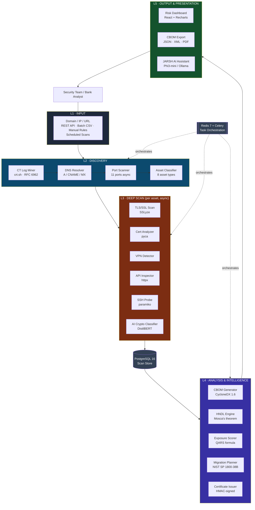
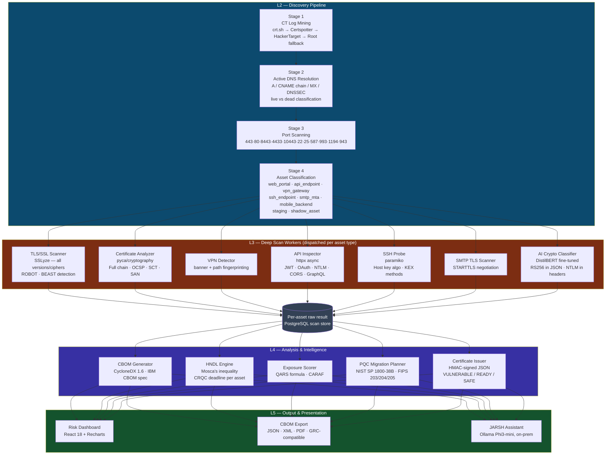
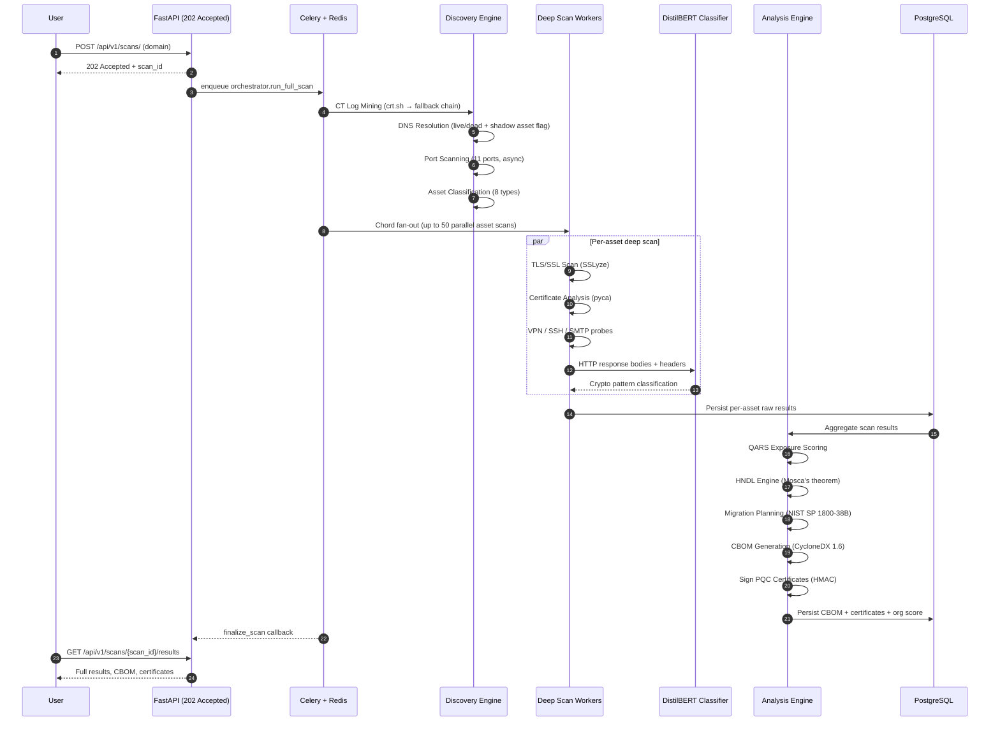
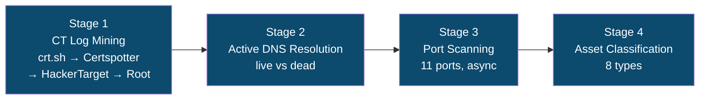
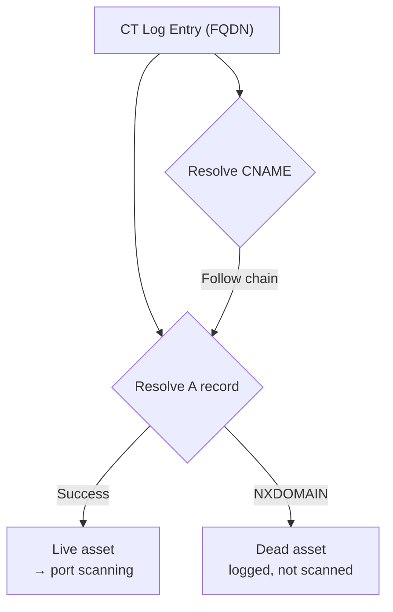
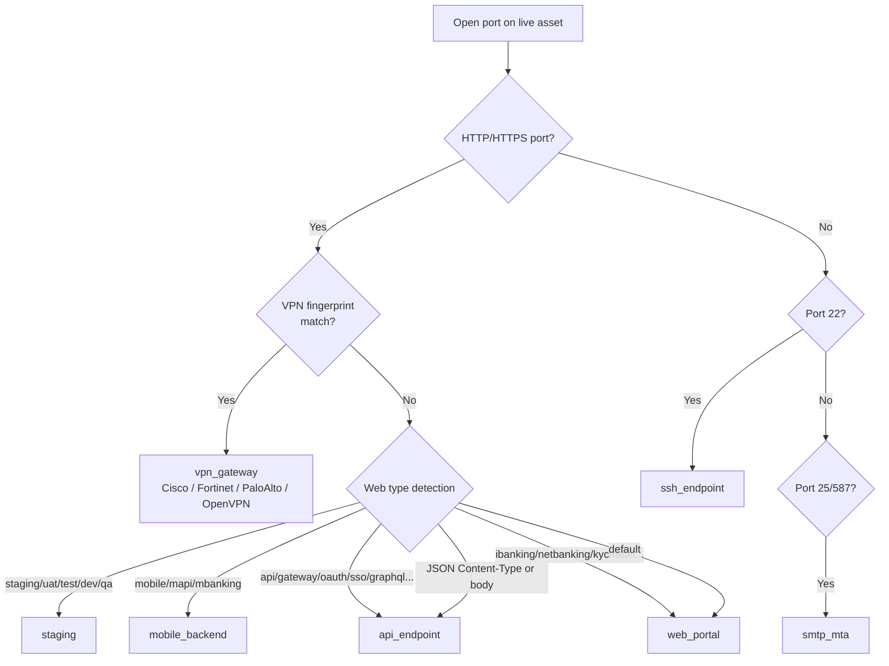
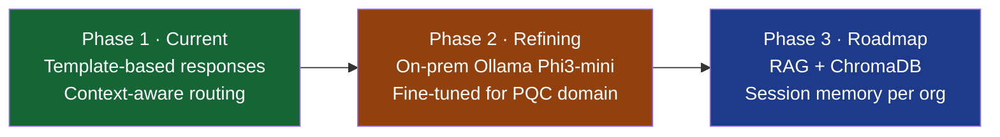

<div align="center">

# TRINETRA
### Quantum Exposure Intelligence Platform

**"Find every cryptographic weakness before a quantum computer does."**

[](LICENSE)
[](https://www.python.org/)
[](https://react.dev/)
[](https://fastapi.tiangolo.com/)
[](https://www.docker.com/)
[](https://csrc.nist.gov/projects/post-quantum-cryptography)

**[Quick Demo (1 min)](https://drive.google.com/file/d/12ivyOwy1gowhOoXnHNwV_Eoo-zEEUBzI/view?usp=sharing)** &nbsp;•&nbsp; **[Full Walkthrough (23 min)](https://drive.google.com/file/d/1LPlKyv6cbAyb0BZyAdMONuz3OCm26A8c/view?usp=sharing)**

### Project Overview
TRINETRA is a quantum exposure intelligence platform designed to discover cryptographic weaknesses across digital assets, assess organizational risk, and support practical migration planning toward post-quantum cryptography.

</div>

---

## Table of Contents

- [Why TRINETRA](#why-trinetra)
- [High-Level Architecture](#high-level-architecture)
- [Detailed Layer Architecture](#detailed-layer-architecture)
- [Scan Pipeline (Sequence Flow)](#scan-pipeline-sequence-flow)
- [Tech Stack](#tech-stack)
- [Unique Selling Points](#unique-selling-points)
- [System Components](#system-components)
- [JARSH — AI Security Assistant](#jarsh--ai-security-assistant)
- [Scoring Formula](#scoring-formula-qars)
- [Classification Schema](#classification-schema)
- [API Reference](#api-reference)
- [Quick Start](#quick-start)
- [Running Without Docker](#running-without-docker)
- [Environment Variables](#environment-variables)
- [Troubleshooting](#troubleshooting)
- [Research Basis](#research-basis)
- [Team](#team)

---

## Why TRINETRA

Cryptographically-Relevant Quantum Computers (CRQCs) are projected to arrive between **2028–2037**. When they do, **every RSA, ECDSA, and ECDHE-protected system becomes retroactively decryptable** — including data intercepted today ("Harvest Now, Decrypt Later" attacks).

Most banks have no idea:

- How many subdomains they actually have (shadow assets)
-  Which ones use quantum-vulnerable cryptography
- How much time they have before their data becomes exposed
- What exactly needs to change, and in what order

**TRINETRA answers all four questions in a single scan.**

### The Competition Gap

| Capability | Typical Tools | TRINETRA |
|---|---|---|
| Asset discovery | Known ports only | CT log mining — finds forgotten subdomains |
| TLS analysis | Preferred cipher only | All accepted ciphers — catches weak fallbacks |
| API crypto detection | Header rules | DistilBERT NLP — finds `RS256` inside JSON bodies |
| Scoring formula | Arbitrary numbers | QARS formula (MDPI 2025) with Mosca's theorem |
| Output | Score only | CBOM + migration plan + signed certificate |
| VPN detection | None | Cisco AnyConnect, Fortinet, Palo Alto, OpenVPN |
| SSH analysis | None | NIST SP 1800-38B compliant host key + KEX audit |

---

## High-Level Architecture



---

## Detailed Layer Architecture



### Architectural Enhancements

The TRINETRA engine has been completely overhauled from sequential Celery-based processing into a highly concurrent asynchronous architecture:

- **Asyncio Parallelization** — replaced sequential operations with a concurrent `asyncio` model, processing multiple domains and assets simultaneously.
- **Adaptive Timeouts & Incremental Scanning** — reduced redundant operations by intelligently skipping unchanged assets and gracefully timing out unresponsive subdomains.
- **Batched ML Inference & Persistence** — batched DistilBERT inference and database writes, cutting scan time from **17 minutes to ~1.3 minutes** for 1,000 assets.
- **Manual Rules Engine** — users can set manual heuristic rules directly from the inventory.

---

## Scan Pipeline (Sequence Flow)



---

## Tech Stack

| Layer | Technologies |
|---|---|
| **Frontend** | React 18, Vite, TypeScript, TailwindCSS, Recharts |
| **Backend** | FastAPI (Async), Python 3.10+, SQLAlchemy, Alembic |
| **Scanning Engine** | SSLyze, pyca/cryptography, httpx (Async), Paramiko, custom DNS/CT pipeline |
| **AI & Intelligence** | Custom fine-tuned DistilBERT (NLP), local Ollama Phi3-mini (on-prem JARSH) |
| **Task Queues** | Celery, Redis 7, Asyncio |
| **Database** | PostgreSQL 16 (async pipeline) |
| **Deployment** | Docker, Docker Compose |

---

## Unique Selling Points

### USP 1 — Asset Discovery: Finding Every Endpoint

A **4-stage discovery pipeline** finds every public-facing surface — including subdomains the bank's own team has forgotten.



#### Stage 1 — Certificate Transparency (CT) Log Mining

Every TLS certificate ever issued for a domain is publicly logged (RFC 6962). TRINETRA mines these logs to extract every subdomain that has ever existed, including decommissioned services, exposed staging environments, and shadow assets untracked in the bank's CMDB.

**4-source fallback chain** (never returns empty):

| Priority | Source | Method | Notes |
|----------|--------|--------|-------|
| 1 | **crt.sh** | `?.domain` wildcard query, JSON deduplicated | Primary — most complete CT index |
| 2 | **Certspotter** | `/v1/issuances?include_subdomains=true` | Real-time CT stream, independent infra |
| 3 | **HackerTarget** | Passive DNS hostsearch API | CSV format, no auth required |
| 4 | **Root domain** | Direct fallback | Guarantees ≥ 1 asset always exists |

**Why most implementations miss ~30% of assets:** the `name_value` field in crt.sh responses is **newline-separated** — a single certificate can list multiple SANs. Naive parsers only read the first name; TRINETRA splits and processes every SAN in every certificate record.

**Retry policy:** exponential back-off on `429/500/502/503/504` — up to 4 attempts, 3–30s wait windows.

**Input normalisation** handles any pasted format:

```
https://pnb.bank.in/path?q=1  →  pnb.bank.in
HTTPS://PNB.BANK.IN            →  pnb.bank.in
pnb.bank.in:443                →  pnb.bank.in
www.pnb.bank.in                →  pnb.bank.in
```

#### Stage 2 — Active DNS Resolution

CT log entries are **historical** — they prove a domain *was* active, not that it *is*. Every discovered FQDN is validated live via async DNS resolution.



- **Concurrency:** configurable semaphore (default 20 parallel DNS queries)
- **CNAME chain following:** handles CDN-fronted assets (`api.bank.in → bank.azureedge.net → 1.2.3.4`)
- **Shadow asset detection:** FQDNs not in the bank's confirmed asset list flagged `is_shadow_asset=True`
- **MX resolution:** mail servers discovered separately, fed to the SMTP scanner
- **DNSSEC check:** DS record presence detected at the parent zone

**Output:** `(live_assets[], dead_assets[])` — only live assets proceed to port scanning.

#### Stage 3 — Port Scanning

Each live IP is probed across **11 ports** with async TCP connect, all simultaneously via `asyncio.gather`:

| Port(s) | Protocol | Dispatches Scanner |
|------|----------|-------------------|
| `443` | HTTPS | TLS + Certificate + API + DistilBERT AI |
| `80` | HTTP | API Inspector |
| `8443`, `4433`, `10443` | HTTPS-alt | TLS + Certificate + VPN Detector |
| `22` | SSH | SSH Probe (host key, KEX methods) |
| `25`, `587` | SMTP / Submission | SMTP TLS Scanner |
| `993` | IMAPS | TLS Scanner |
| `1194`, `943` | OpenVPN | VPN Detector |

#### Stage 4 — Asset Classification

Each open port gets an HTTP fingerprint (HEAD → fallback GET) and is classified into one of **8 asset types**.



**Scanner dispatch per asset type:**

| Asset Type | TLS | Cert | VPN | API | SSH | SMTP | AI |
|------------|:---:|:---:|:---:|:---:|:---:|:---:|:---:|
| `web_portal` |  |  | |  | | |  |
| `api_endpoint` |  |  | |  | | |  |
| `vpn_gateway` |  |  |  | | | | |
| `ssh_endpoint` | | | | |  | | |
| `smtp_mta` | | | | | |  | |
| `mobile_backend` |  |  | |  | | |  |
| `staging` |  |  | |  | | |  |
| `shadow_asset` |  |  | |  | | |  |

> *Scheitle et al., ACM IMC 2018: CT log data reveals 30–40% more subdomains than DNS enumeration alone.*

### USP 2 — AI Crypto Pattern Classifier

The deterministic TLS scanner checks what it knows about. The **DistilBERT NLP classifier** reads raw HTTP responses the way a human security analyst would — finding cryptographic references buried in JSON bodies, error messages, `WWW-Authenticate` headers, custom proprietary headers, and debug endpoints.

> *Sanh et al. 2019 (DistilBERT): 40% smaller than BERT with 97% accuracy.*

### USP 3 — HNDL Engine with Mosca's Theorem

Every asset gets a concrete migration deadline, not just a score. The **HNDL (Harvest Now, Decrypt Later) Engine** implements Mosca's inequality:

```
If (data shelf life X) + (migration time Y) > (years to CRQC Z) → Act NOW
```

Configurable CRQC scenarios: pessimistic (2028), moderate (2032), optimistic (2037).

### USP 4 — QARS Scoring Formula

```
Score = (Algorithm Risk × 40%) + (HNDL Timeline × 40%) + (Public Exposure × 20%)
```

Every factor has a calibrated lookup table. Unlike competitor tools with arbitrary numbers, TRINETRA's formula is published and reproducible.

> *QARS paper: MDPI Electronics, August 2025. CARAF: Oxford Cybersecurity, 2021.*

### USP 5 — Data Sensitivity Tier

| Tier | Shelf Life | Example |
|------|-----------|---------|
| `transaction` | 7 years | Payment APIs, core banking |
| `authentication` | 1 year | Login endpoints, OAuth servers |
| `static` | 0 years | Public web portals |

### USP 6 — VPN Detection

Most teams skip VPN gateways entirely. TRINETRA fingerprints and scans Cisco AnyConnect, Fortinet FortiGate, Palo Alto GlobalProtect, and OpenVPN. VPN gateways typically have the worst scores — managed by network teams, running vendor defaults from 2015.

### USP 7 — SSH Host Key Audit (NIST SP 1800-38B)

Extracts host key algorithm (`ssh-rsa` vs `Ed25519`), KEX methods (`diffie-hellman-group14` vs `curve25519` vs `mlkem768`), and server version string — a gap most competing tools miss.

### USP 8 — Signed PQC Readiness Certificates

Every scanned asset gets a **TRINETRA CERTIFIED** HMAC-signed JSON certificate:

-  `QUANTUM_VULNERABLE` — classical crypto only
-  `PQC_READY` — hybrid mode (classical + NIST PQC)
-  `FULLY_QUANTUM_SAFE` — 100% NIST PQC, no classical fallback

Certificates contain asset URL, scan date, detected algorithm, NIST standard reference, validity period, and a tamper-evident signature — presentable to RBI auditors directly.

---

## System Components

### Backend (`backend/`)

| Module | Purpose |
|--------|---------|
| `api/` | FastAPI REST layer — 202 Accepted async pattern |
| `engine/discovery/` | CT log mining, DNS resolution, port scanning, asset classification |
| `engine/scanners/` | TLS (SSLyze), certificate (pyca), VPN, API (httpx), SSH (paramiko), SMTP |
| `engine/ai/` | DistilBERT classifier |
| `engine/analysis/` | CBOM generator, HNDL engine, exposure scorer, migration planner |
| `engine/output/` | Certificate issuer, report generator |
| `workers/` | Celery tasks — orchestrator, scan tasks, AI tasks, analysis tasks |
| `db/` | SQLAlchemy models, repository layer, Alembic migrations |
| `core/` | Config, constants (scoring weights), security (HMAC signing) |

### Frontend (`frontend/`)

| Page | Purpose |
|------|---------|
| Dashboard | Organization risk score, asset map, risk distribution charts |
| Asset Inventory | Full asset list with filters, sensitivity tier override |
| Asset Discovery | CT log topology graph, domain scan initiation |
| CBOM | Operations center — PQC certificates, cryptographic asset map |
| Posture of PQC | Migration readiness timeline |
| Cyber Rating | QARS score breakdown per asset |
| Scan History | Historical scan comparison |

### Infrastructure

| Service | Image | Purpose |
|---------|-------|---------|
| `postgres` | postgres:16-alpine | Scan results, assets, certificates |
| `redis` | redis:7-alpine | Celery task broker |
| `api` | Custom (FastAPI) | REST API, 202 async scan pattern |
| `worker` | Custom (Celery) | Scan pipeline execution (2 replicas) |
| `flower` | Custom (Celery Flower) | Task queue monitoring at :5555 |
| `frontend` | Custom (Vite/React) | UI at :3000 |

---

## JARSH — AI Security Assistant

**JARSH** is an intelligent floating chatbot integrated into the TRINETRA dashboard, helping users understand their security posture, analyze scan results, and plan mitigation strategies.

### Capabilities

| Capability | Description |
|---|---|
| General Queries | Questions about TRINETRA, PQC, quantum threats, and cryptography |
| Scan Context | Ask about specific scan results, detected algorithms, exposure levels |
| Mitigation Advice | Step-by-step guidance moving from RSA/ECDSA to ML-KEM/ML-DSA |
| Quantum Timeline | When your organization becomes quantum-vulnerable (Mosca's theorem) |
| PQC Readiness | Compliance status with NIST FIPS 203/204/205 and hybrid adoption |
| Asset Insights | Intelligence on shadow assets, high-risk endpoints, remediation priorities |

### Rollout Plan



- **Phase 1 (Current):** template-based responses with confidence scoring and context awareness.
- **Phase 2 (Refining):** local Ollama + Phi3-mini, fine-tuned on NIST PQC standards, Shor's/Grover's algorithm papers, and TRINETRA scan patterns; Q4_K_M quantization for 4GB+ VRAM; zero data exfiltration, sub-100ms inference.
- **Phase 3 (Roadmap):** ChromaDB vector store indexing all CBOM reports, multi-turn session memory, persistent chat history per organization.

### How to Use

1. Open the dashboard at `http://localhost:3000`
2. Click the **JARSH** button in the bottom-right corner
3. Ask things like *"Is my organization quantum-vulnerable?"* or *"What's the safest migration path from RSA-2048?"*

---

## Scoring Formula (QARS)

### QARS (Quantum-Adjusted Risk Score)

```
Score = (Algorithm Risk × 0.40) + (HNDL Timeline × 0.40) + (Public Exposure × 0.20)
```

**Algorithm Risk (0–100):**

| Algorithm | Risk | Reason |
|-----------|------|--------|
| RSA-2048 | 90 | Shor's algorithm — broken by CRQC |
| ECDSA-256 | 85 | Elliptic curve — quantum-vulnerable |
| ECDHE | 85 | Key exchange — quantum-vulnerable |
| NTLM | 95 | No PQC migration path |
| ML-KEM-768 | 2 | NIST FIPS 203 — fully quantum-safe |
| ML-DSA-65 | 2 | NIST FIPS 204 — fully quantum-safe |
| AES-256 | 10 | Grover: 128-bit effective — still safe |

**HNDL Timeline (0–100):** based on Mosca's inequality, adjusted by data sensitivity tier.

**Public Exposure (0–100):** `web_portal=100`, `vpn_gateway=85`, `shadow_asset=90`, `ssh_endpoint=70`

**Risk Tiers:**

| Score | Tier | Action |
|-------|------|--------|
| 80–100 |  CRITICAL | Immediate migration required |
| 60–79 |  HIGH | Urgent — within 6 months |
| 40–59 |  MEDIUM | Planned — within 18 months |
| 20–39 |  LOW | Monitor — within 3 years |
| 0–19 |  SAFE | No action required |

---

## Classification Schema

### PQC Certificate Tiers

| Tier | Color | Condition |
|------|-------|-----------|
| `QUANTUM_VULNERABLE` |  Red | RSA, ECDSA, ECDHE, DHE, NTLM detected |
| `PQC_READY` |  Amber | Hybrid mode: X25519Kyber768, P256-ML-KEM-768 |
| `FULLY_QUANTUM_SAFE` |  Green | Pure NIST PQC: ML-KEM-768, ML-DSA-65, SPHINCS+ |

### Asset Types

| Type | Description |
|------|-------------|
| `web_portal` | Customer-facing HTTPS site |
| `api_endpoint` | REST/GraphQL API |
| `vpn_gateway` | SSL VPN (Cisco/Fortinet/Palo Alto/OpenVPN) |
| `ssh_endpoint` | SSH management access |
| `smtp_mta` | Mail transfer agent |
| `mobile_backend` | Mobile app backend |
| `staging` | Staging/UAT environment |
| `shadow_asset` | Not in bank's known asset list |

---

## API Reference

| Method | Endpoint | Description |
|--------|----------|-------------|
| `POST` | `/api/v1/scans/` | Initiate scan (returns 202 + scan_id) |
| `GET` | `/api/v1/scans/{scan_id}` | Poll scan status + progress |
| `GET` | `/api/v1/scans/` | List recent scans |
| `GET` | `/api/v1/scans/{scan_id}/results` | Full scan results JSON |
| `POST` | `/api/v1/scans/{scan_id}/cancel` | Cancel running scan |
| `GET` | `/api/v1/assets/` | List assets (filter by scan_id or domain) |
| `GET` | `/api/v1/assets/{asset_id}` | Full asset detail |
| `PATCH` | `/api/v1/assets/{asset_id}/sensitivity-tier` | Override data sensitivity tier |
| `GET` | `/api/v1/cbom/` | CBOM summary (by scan_id or domain) |
| `GET` | `/api/v1/cbom/{scan_id}` | Full CycloneDX 1.6 CBOM |
| `GET` | `/api/v1/certificates/` | List PQC certificates |
| `GET` | `/api/v1/certificates/scan/{scan_id}` | Certificates for a scan |
| `GET` | `/api/v1/certificates/{cert_id}` | Single certificate detail |
| `GET` | `/api/v1/dashboard/{domain}` | Aggregated risk stats for domain |
| `GET` | `/api/v1/health` | API health check |
| `GET` | `/api/v1/health/queue` | Redis + Celery connectivity check |

Full interactive docs: **http://localhost:8000/docs**

---

## Quick Start

### Prerequisites

- Docker 24+ and Docker Compose v2
- 4GB RAM minimum (DistilBERT model loads ~67MB into memory)
- Ports `3000, 8000, 5432, 6379, 5555` available

### 1. Clone and configure

```bash
git clone https://github.com/shivajirathod007/TRINETRA.git
cd trinetra
cp .env.example .env
```

### 2. Start all services

```bash
docker compose up --build -d
```

This starts: PostgreSQL, Redis, FastAPI backend, 2× Celery workers, Flower monitor, React frontend.

### 3. Verify everything is running

```bash
docker compose ps
curl http://localhost:8000/health
curl http://localhost:8000/api/v1/health/queue
```

### 4. Access the application

| Service | URL |
|---------|-----|
| Frontend UI | http://localhost:3000 |
| API Docs (Swagger) | http://localhost:8000/docs |
| Celery Flower Monitor | http://localhost:5555 |

### 5. Run your first scan

1. Open http://localhost:3000
2. Navigate to **Asset Discovery**
3. Enter a domain (e.g. `pnb.in` or `cloudflare.com`)
4. Click **Scan Now** and watch real-time progress
5. Once complete, navigate to **CBOM** to see results

> **Testing PQC detection:** scan `cloudflare.com` — Cloudflare has deployed X25519Kyber768 hybrid TLS on all edge servers since 2023.

---

## Running Without Docker

```bash
# 1. Dependencies
pg_ctl start          # or: brew services start postgresql
redis-server           # or: brew services start redis

# 2. Backend
cd backend
pip install -r requirements.txt
alembic upgrade head
uvicorn api.main:app --reload --port 8000

# 3. Celery worker (required for scans)
celery -A workers.celery_app worker -Q scans,discovery,analysis --loglevel=info --concurrency=4

# 4. Frontend
cd ../frontend
npm install
npm run dev
```

---

## Environment Variables

| Variable | Default | Description |
|----------|---------|-------------|
| `DATABASE_URL` | `postgresql+asyncpg://...` | Async PostgreSQL URL |
| `DATABASE_URL_SYNC` | `postgresql://...` | Sync PostgreSQL URL (Celery) |
| `REDIS_URL` | `redis://localhost:6379/0` | Redis broker URL |
| `APP_ENV` | `development` | `development` or `production` |
| `CRQC_PESSIMISTIC_YEAR` | `2028` | Pessimistic CRQC arrival estimate |
| `CRQC_MODERATE_YEAR` | `2032` | Moderate CRQC arrival estimate |
| `CRQC_OPTIMISTIC_YEAR` | `2037` | Optimistic CRQC arrival estimate |
| `SECRET_KEY` | — | HMAC key for certificate signing |
| `CRTSH_BASE_URL` | `https://crt.sh` | CT log API base URL |
| `CT_LOG_TIMEOUT_SECONDS` | `30` | Timeout for CT log queries |
| `DNS_CONCURRENCY` | `20` | Parallel DNS resolution limit |
| `PORT_SCAN_TIMEOUT` | `3` | TCP connect timeout (seconds) |

---

## Troubleshooting

<details>
<summary><strong>Scans stay "Queued"</strong></summary>

```bash
curl http://localhost:8000/api/v1/health/queue
docker compose logs worker --tail=50
docker compose restart worker
```
</details>

<details>
<summary><strong>Scans get stuck at X%</strong></summary>

- **0 live hosts found:** subdomains resolved but nothing is listening on scanned ports — normal for domains with aggressive firewalls (e.g. Cloudflare blocks port scanners). The scan will eventually time out and complete.
- **Stuck at 20%:** port scanning completed but asset classification found 0 HTTPS endpoints — check if the domain uses non-standard ports.
- **Worker crash:** check `docker compose logs worker` for Python exceptions.
</details>

<details>
<summary><strong>AI Classifier not working</strong></summary>

DistilBERT model weights load from `backend/engine/ai/loaded_model/`. If the model files are missing, the AI step is skipped and only deterministic scanners run.
</details>

<details>
<summary><strong>Database connection errors</strong></summary>

```bash
docker compose ps postgres
docker compose exec api alembic upgrade head
```
</details>

---

## Research Basis

| Research | Application in TRINETRA |
|----------|------------------------|
| Mosca (2018) — Mosca's inequality | HNDL deadline calculation per asset |
| NIST IR 8547 (2024) | Algorithm security level weights |
| NSA CNSA 2.0 (2022) | Algorithm phase-out schedule |
| NIST FIPS 203/204/205 (August 2024) | PQC algorithm classification |
| NIST SP 1800-38B | Migration step mapping |
| QARS paper — MDPI Electronics (August 2025) | Multi-factor weighted scoring formula |
| CARAF — Oxford Cybersecurity (2021) | Crypto agility risk framework |
| Sanh et al. (2019) — DistilBERT | AI classifier model selection |
| Scheitle et al. — ACM IMC 2018 | CT log mining methodology |
| Böck et al. — USENIX Security 2018 | ROBOT vulnerability detection |
| IBM Research CBOM spec (Vassilev et al., 2022) | CBOM schema design |
| OWASP CycloneDX 1.6 | CBOM output format |
| Europol Quantum Safe Financial Forum (Jan 2026) | Financial sector scoring methodology |

---

## License

This project is licensed under the MIT License — see the [LICENSE](LICENSE) file for details.

---

<div align="center">

*TRINETRA — Sanskrit for "three-eyed" — sees what others miss.*

</div>